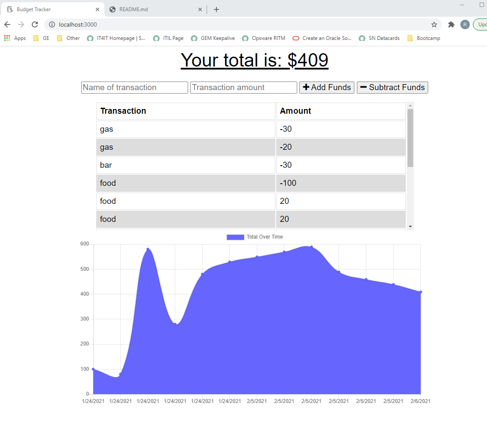

# PWA-Homework-Online-Offline-Budget-Trackers

## Table of contents

- [Description](#description)
- [Application Screen Shot](#application-screen-shot)
- [Installation](#installation)
- [Usage](#usage)
- [Technologies Used](#technologies-used)
- [Licence](#licence)
- [Repository Link](#repository)
- [Heroku Link](#heroku)

## Description 
Utilizing this app, the user will be able to add expenses and deposits to their budget with or without a connection. When entering transactions offline, they should populate the total when brought back online.

Offline Functionality:

  * Enter deposits offline

  * Enter expenses offline

When brought back online:

  * Offline entries should be added to tracker.

## Application screen shot

## Installation
Repository at: https://github.com/rich30041/PWA-Homework-Online-Offline-Budget-Trackers

Deployed live at: https://serene-island-68763.herokuapp.com/

## Usage
1. Navigate to https://serene-island-68763.herokuapp.com/
2. Add withdrawals and deposits as desired
3. Right click, and choose Inspect. Navigate to Application, and from there to Service Workers.
4. Set service worker to offline, and reload. You are now working offline.
5. Add some additional transactions, then set the Service Worker back to online and refresh.
6. You should be able to see your offline transactions synced up with your online transactions.

## Technologies Used
* Frontend: HTML, CSS, Bootstrap
* Backend: Express, NodeJS, Service worker, Manifest, Webpack
* Database: MongoDB, Mongoose schema

## Repository

- [Project Repository](https://github.com/rich30041/PWA-Homework-Online-Offline-Budget-Trackers)

## Heroku
- [Heroku App Link](https://serene-island-68763.herokuapp.com/)